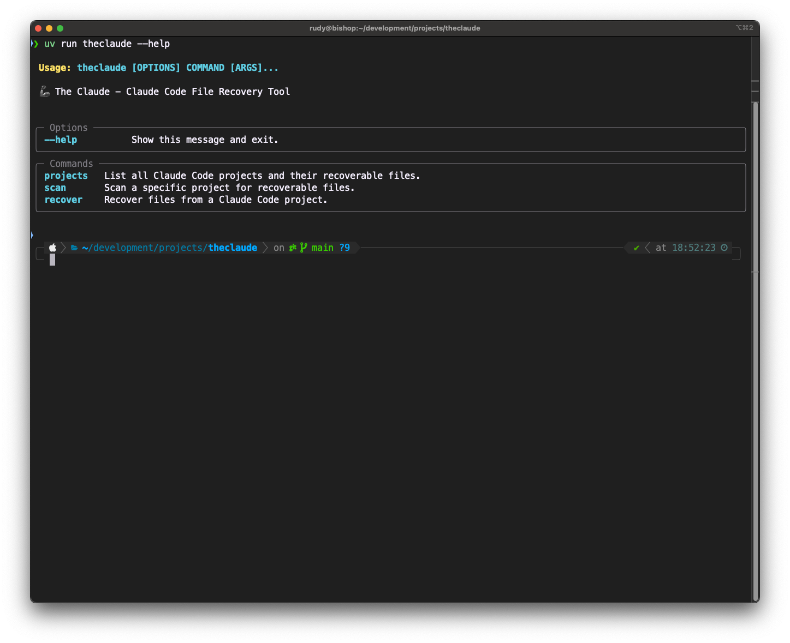
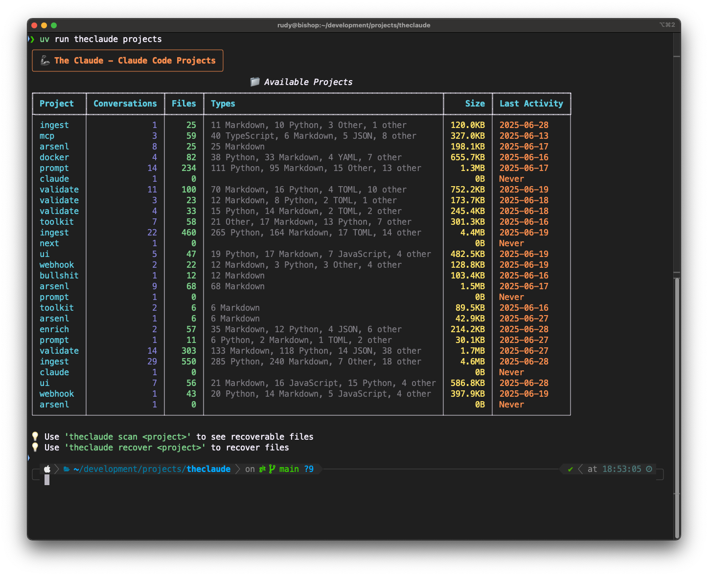
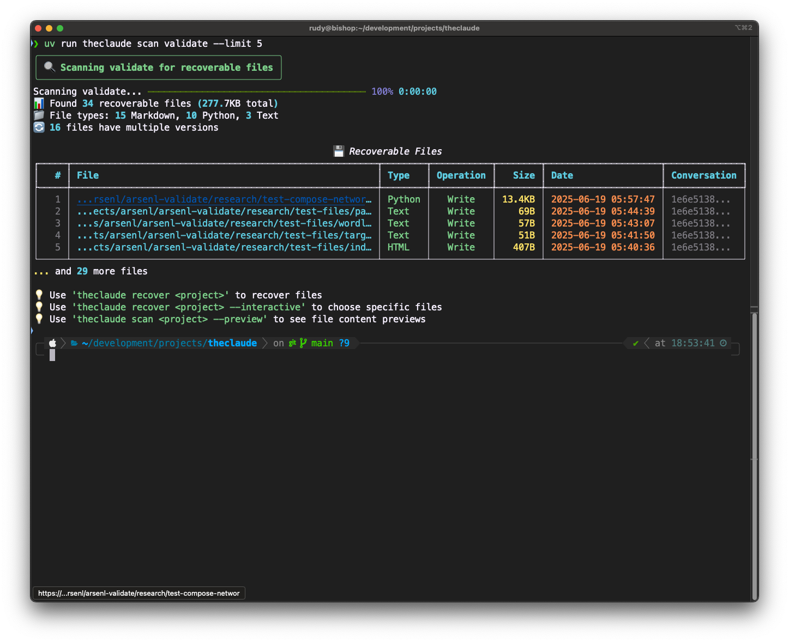

# 🦾 The Claude

**Claude Code File Recovery Tool**

Like the claw from Toy Story, The Claude reaches deep into your Claude Code conversation logs to rescue files that have been lost, deleted, or accidentally overwritten. It's a slick Python tool that automatically scans your `~/.claude/projects` directory and helps you recover any files that were created or modified during your Claude Code sessions.

## ✨ Features

- 🔍 **Auto-discovery**: Automatically finds all Claude Code projects in `~/.claude/projects`
- 📁 **Smart scanning**: Parses conversation logs to find Write, Read, Edit, and MultiEdit operations
- 🎯 **File type filtering**: Filter by Python, JavaScript, Markdown, or any file type
- 👀 **Content preview**: See file content before recovery with `--preview`
- 🔄 **Version detection**: Shows when files have multiple versions available
- 💾 **Flexible recovery**: Recover to safe directories with structure preservation
- 🎯 **Interactive selection**: Choose exactly which files to recover
- 📊 **Smart statistics**: File type breakdowns, size summaries, and recovery reports
- 🛡️ **Safety first**: Creates backups before overwriting existing files
- ⚡ **Fast scanning**: Efficient JSONL parsing with progress indicators

## 🚀 Installation

```bash
# Clone and install
git clone https://github.com/nickpending/theclaude.git
cd theclaude

# Install with uv (recommended)
uv sync
uv run theclaude --help

# Or install globally
uv tool install .
theclaude --help
```

## 📸 Screenshots

### Command Help


### Smart Project Discovery


### File Scanning with Preview


## 📖 Usage

### List all projects with smart breakdowns
```bash
theclaude projects
```
Shows all Claude Code projects with file counts, types, sizes, and last activity:
```
📁 Available Projects
┌──────────────┬─────┬─────┬──────────────────────────────┬────────┬─────────────┐
│ Project      │ ... │ ... │ Types                        │ Size   │ Last Act... │
├──────────────┼─────┼─────┼──────────────────────────────┼────────┼─────────────┤
│ my-app       │  15 │  42 │ 25 Python, 12 Markdown, ... │ 2.1MB  │ 2025-06-28  │
└──────────────┴─────┴─────┴──────────────────────────────┴────────┴─────────────┘
```

### Scan with smart filtering and previews
```bash
# See all files with enhanced stats
theclaude scan myproject
# 📊 Found 42 recoverable files (2.1MB total)
# 📁 File types: 25 Python, 12 Markdown, 5 Other
# 🔄 8 files have multiple versions

# Filter by file type
theclaude scan myproject --type Python
theclaude scan myproject --type JavaScript
theclaude scan myproject --type Markdown

# Preview file content before recovery
theclaude scan myproject --preview
# Shows first line of each file in the table
```

### Smart recovery with detailed reports
```bash
# Recover to default directory (./recovered-files)
theclaude recover myproject

# Recover to a specific directory
theclaude recover myproject --target ./my-recovery-dir

# Preview what would be recovered (dry run)
theclaude recover myproject --preview
```

**Note:** For safety, theclaude defaults to recovering files to `./recovered-files` rather than their original paths. Use `--target` to specify a different location.

### Interactive recovery with filtering
```bash
# Choose which files to recover interactively
theclaude recover myproject --interactive

# Combine filtering with interactive selection
theclaude scan myproject --type Python --interactive

# Combine with custom target directory
theclaude recover myproject --interactive --target ./my-files

# Exit interactive selection with 'q', 'quit', 'exit', or just press Enter
```

### Advanced options
```bash
# Force overwrite without prompting
theclaude recover myproject --force

# Don't create backup files
theclaude recover myproject --no-backups

# Flatten directory structure (don't preserve paths)
theclaude recover myproject --target ./files --flat
```

## 🎯 Examples

### Enhanced workflow with new features
```bash
# 1. See what projects are available with smart breakdowns
$ theclaude projects
📁 Available Projects
┏━━━━━━━━━━━━━━━━━━━━┳━━━━━━━━━━━━━━━┳━━━━━━━┳━━━━━━━━━━━━━━━━━━━━━━━━━━━━━━━━━━━━━━━━━━━━━━━┳━━━━━━━━┳━━━━━━━━━━━━━━┓
┃ Project            ┃ Conversations ┃ Files ┃ Types                                         ┃ Size   ┃ Last Activity┃
┡━━━━━━━━━━━━━━━━━━━━╇━━━━━━━━━━━━━━━╇━━━━━━━╇━━━━━━━━━━━━━━━━━━━━━━━━━━━━━━━━━━━━━━━━━━━━━━━╇━━━━━━━━╇━━━━━━━━━━━━━━┩
│ my-web-app         │            15 │    42 │ 25 Python, 12 JavaScript, 5 other           │ 2.1MB  │ 2025-06-28   │
│ ai-toolkit         │             8 │    18 │ 15 Python, 3 Markdown                       │ 876KB  │ 2025-06-27   │
└────────────────────┴───────────────┴───────┴───────────────────────────────────────────────┴────────┴──────────────┘

# 2. Scan with smart filtering and stats
$ theclaude scan my-web-app --type Python --preview
🔍 Scanning my-web-app for recoverable files
📊 Found 25 recoverable files (1.2MB total)
📁 File types: 25 Python
🔄 5 files have multiple versions

💾 Recoverable Files
┏━━━━━┳━━━━━━━━━━━━━━━━━━━━━━━┳━━━━━━━━━━━━━┳━━━━━━━━━━━┳━━━━━━━┳━━━━━━━━━━━━━━━━━━━━━━━━━━━━━━━━━━━━━━━━┳━━━━━━━━━━━━━━━━━━━━┳━━━━━━━━━━━━━┓
┃   # ┃ File                  ┃ Type        ┃ Operation ┃  Size ┃ Preview                                ┃ Date               ┃ Conversation┃
┡━━━━━╇━━━━━━━━━━━━━━━━━━━━━━━╇━━━━━━━━━━━━━╇━━━━━━━━━━━╇━━━━━━━╇━━━━━━━━━━━━━━━━━━━━━━━━━━━━━━━━━━━━━━━━╇━━━━━━━━━━━━━━━━━━━━╇━━━━━━━━━━━━━┩
│   1 │ src/main.py           │ Python (3v) │   Write   │ 15KB  │ from fastapi import FastAPI, HTTPEx... │ 2025-06-28 10:30:45│ a1b2c3d4... │
│   2 │ src/models/user.py    │ Python      │   Write   │  3KB  │ from sqlalchemy import Column, Integ... │ 2025-06-28 09:15:22│ a1b2c3d4... │
│   3 │ src/utils/helpers.py  │ Python (2v) │   Write   │  1KB  │ import json, logging                    │ 2025-06-28 08:45:10│ a1b2c3d4... │
└─────┴───────────────────────┴─────────────┴───────────┴───────┴────────────────────────────────────────┴────────────────────┴─────────────┘

# 3. Interactive recovery with smart reports
$ theclaude recover my-web-app --interactive
📁 Select files to recover:
   (Enter numbers separated by commas, 'all' for all files, or 'q' to quit)

   1. src/main.py (15KB, Python, 3 versions)
   2. src/models/user.py (3KB, Python)
   ...

Select files: 1,2,5-8
🚀 Starting recovery...
✅ Recovered: src/main.py
💾 Created backup: src/main.py.backup
✅ Recovered: src/models/user.py
...

🎉 Recovery Complete: 6 succeeded, 0 failed
📊 Recovered 45.2KB across 2 file types
📁 Types: 5 Python, 1 JavaScript
💾 Created 3 backup files
```

## 🔧 How it works

The Claude scans Claude Code conversation logs (`.jsonl` files) looking for:

1. **Write operations**: Files created with the Write tool
2. **Read operations**: Files read with the Read tool (full content)
3. **Edit operations**: Files modified with Edit tool (future feature)
4. **MultiEdit operations**: Multiple file edits (future feature)

It extracts the file content and metadata, then allows you to recover the files to disk with full control over the process. The new version detection shows when you have multiple versions of the same file available.

## 🛡️ Safety Features

- **Safe recovery location**: Defaults to `./recovered-files` instead of original paths
- **Backup creation**: Automatically backs up existing files before overwriting
- **Confirmation prompts**: Asks before overwriting files (unless `--force` is used)
- **Preview mode**: See what would be recovered without actually doing it
- **Error handling**: Graceful failure handling with detailed error messages

## 🎨 Rich Output

The Claude uses the Rich library to provide beautiful, informative output:
- **Smart statistics**: File type breakdowns, version counts, size summaries
- **Color-coded operation types**: Write (green), Read (blue), Edit (yellow)
- **Progress bars** during scanning with file names
- **Formatted tables** with file information and previews
- **Enhanced recovery reports** with detailed breakdowns

## ✨ New Filtering and Preview Features

### File Type Filtering
```bash
# Show only specific file types
theclaude scan myproject --type Python
theclaude scan myproject --type JavaScript
theclaude scan myproject --type Markdown
```

### Content Preview
```bash
# See file content before recovery
theclaude scan myproject --preview
# Shows first line of each file in a Preview column
```

### Version Detection
- Files with multiple versions show "(3v)" indicator
- Smart deduplication keeps the latest version
- Visual indication of which files have revision history

### Smart Statistics
- **Project level**: "285 Python, 240 Markdown, 7 Other, 18 other"  
- **Scan level**: "📊 Found 42 files (2.1MB total), 📁 File types: 25 Python, 12 Markdown, 🔄 8 files have multiple versions"
- **Recovery level**: "📊 Recovered 45.2KB across 2 file types, 📁 Types: 5 Python, 1 JavaScript"

## 🔮 Future Features

- Support for Edit and MultiEdit operation reconstruction
- File diff viewing before recovery
- Cross-project search capabilities
- Batch recovery across multiple projects
- Integration with git for version control
- Web interface for easier file browsing

## 🐛 Troubleshooting

### No projects found
- Make sure you have Claude Code installed and have used it
- Check that `~/.claude/projects` exists and contains project directories
- Use `--claude-dir` to specify a custom Claude directory location

### Files not showing up
- Only Write and Read operations with full content are currently supported
- Edit and MultiEdit operations require reconstruction (coming soon)
- Check that the conversation logs contain the file operations you expect

### Recovery failures
- Check file permissions on target directories
- Ensure you have write access to the target location
- Use `--preview` to see what would be recovered before trying

### Filtering issues
- File type names are case-sensitive: use "Python" not "python"
- Check available types in the project scan output
- Use scan without filters first to see all available files

## 🤝 Contributing

This tool follows modern Python development practices:
- Python 3.13+ with type hints everywhere
- uv for package management
- pytest for testing
- ruff for linting and formatting
- Rich CLI output

```bash
# Development setup
uv sync
uv run pytest  # Run tests
uv run ruff check .  # Lint code
uv run mypy src/  # Type checking
```

---

**"I have been chosen! Farewell, my friends. I go on to a better place."** - The Claw (and your recovered files)